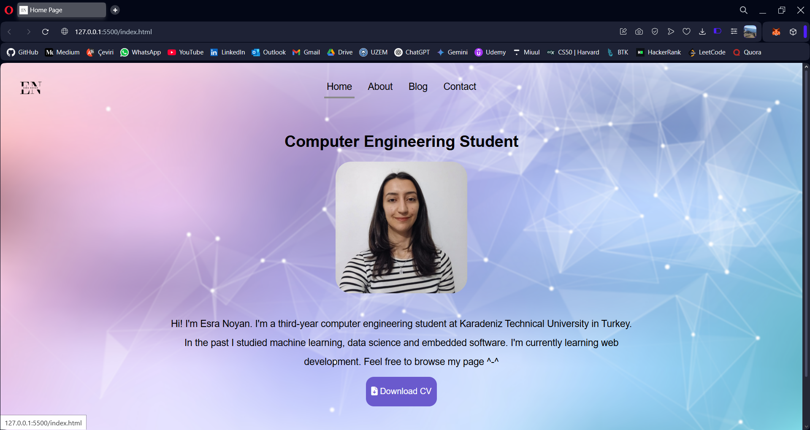
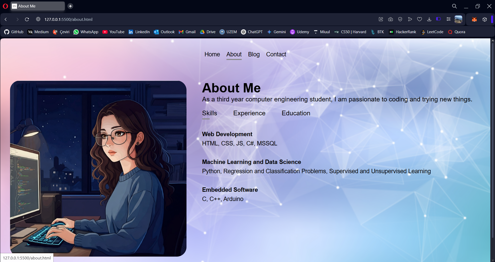
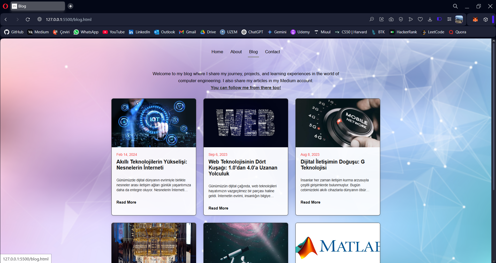
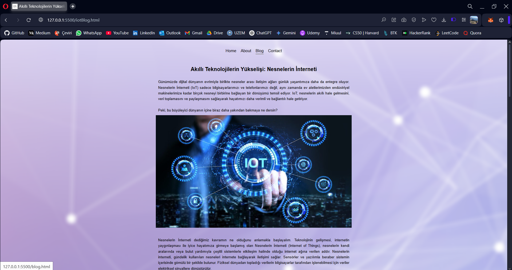
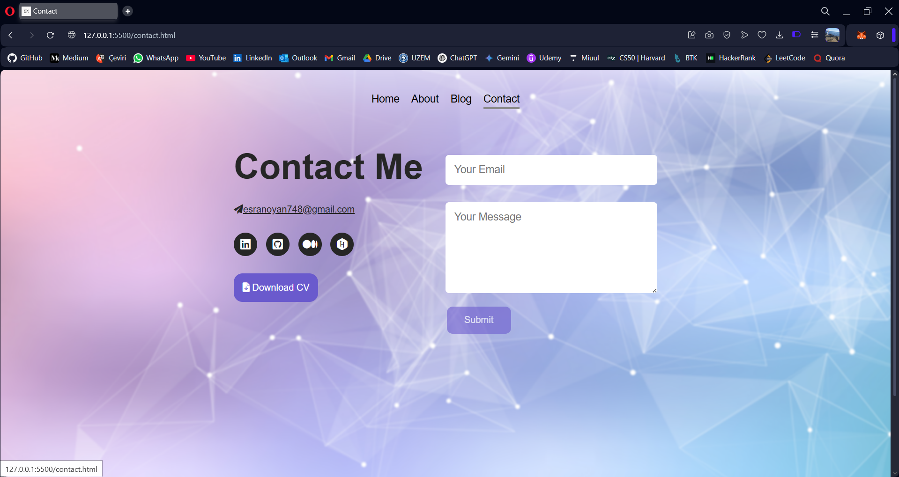

<h2>My-Personal-Website</h2>

I designed my personal website in this project. I used HTML, CSS languages. I ensured the compatibility of the pages on various devices with responsive design.    The interface of the project is as follows:

